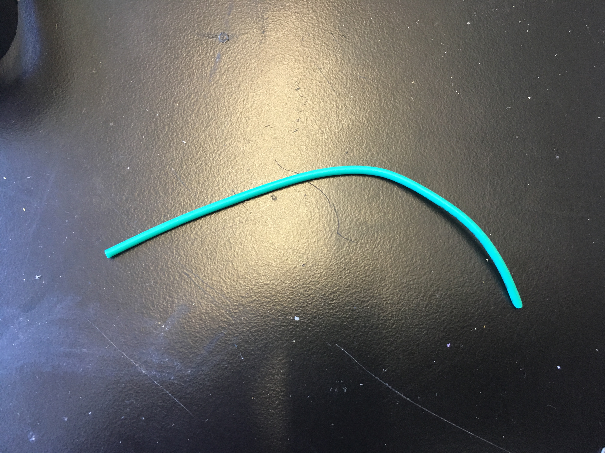
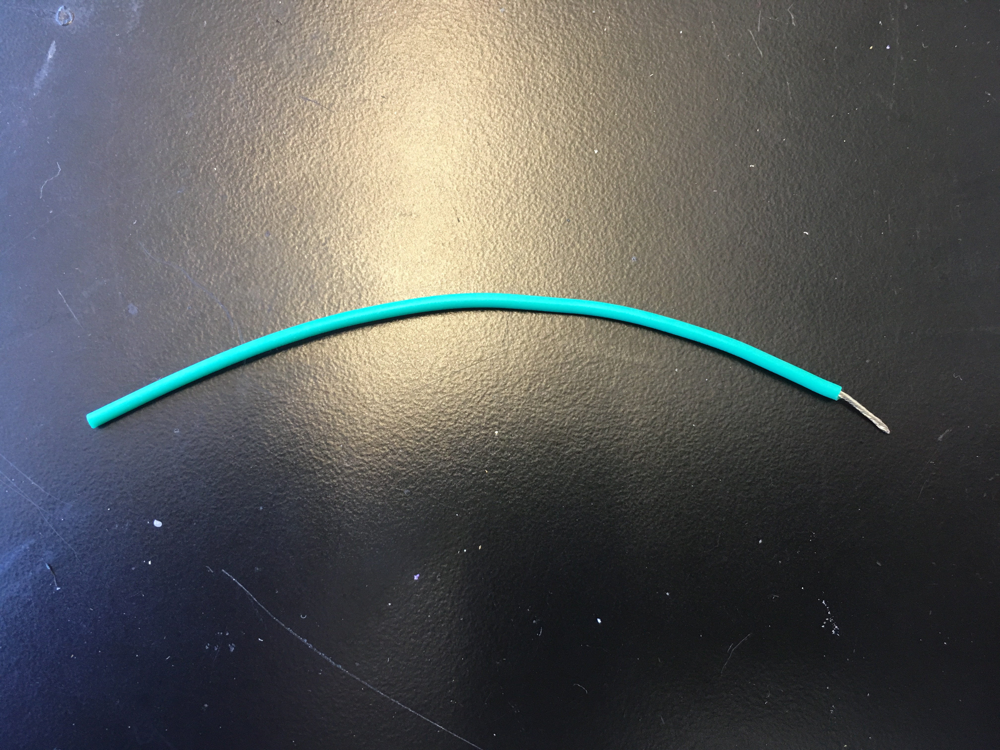

# Prerequisites {#build-prerequisites status=ready}

**Expected Time**: 1 hours

## Preface

This section contains information about the most important skills used in the build. If you are new to soldering, it is recommended that you complete the soldering module before starting the build. Whether you're new too soldering or not, we recommend reading through this page to review the basic techniques used in the build.

## Strip Wires

**Stripping** is the process of removing a portion of insulator from a wire in order to expose its strands. It is done by using a wire stripper. The exposed wire is then able to be tinned and soldered.

<figure class="flow-subfigures">  
    <figcaption>To Strip a Wire</figcaption>
    <figure>
        <figcaption>An unstripped wire</figcaption>
        
    </figure>
    <figure>  
        <figcaption>A stripped wire</figcaption>
        
    </figure>
</figure>

## Tin Wires

**Tinning** is the process of applying solder to exposed wire or metal pad. It is done by using a soldering iron to heat up the metal, and then solder melts into the wire or onto the pad.    

<figure class="flow-subfigures">  
    <figcaption>To Tin a Wire</figcaption>
    <figure>
        <figcaption>An untinned wire</figcaption>
        
    </figure>
    <figure>  
        <figcaption>A tinned wire</figcaption>
        
    </figure>
</figure>

The purpose of tinning wires is to allow them to be joined to other metal components. By itself, stripping would not allow wires to be joined because the exposed wires would have no way to "stick" to each other.

However, tinning *does* allow exposed wires to "stick" (i.e. join) to each other by using the fact that solder turns into a liquid when exposed to high heat, but into a solid when the heat is removed; this means wires can be joined by:

1. Putting the tinned components next to each other so they are touching.

2. Heating up both components simultaneously so the solder in each liquifies. The liquids will then combine.

3. Removing the heat so the liquid solidifies, thus joining the two wires.

See this [tutorial](https://www.youtube.com/watch?v=pRPF4wpXX9Q) to learn how to tin and join two wires.

Since solder is conductive, the resulting joint acts as a bridge for electricity traveling between the connected wires!

Note: Sometimes parts will have wires already tinned out-of-the-box by the manufacturer (i.e. pre-tinned). You can identify this by: 1) the "shininess" of the tip of a wire and 2) the inability to fray the wire strands of the tip of a wire. However, such tinning is often ineffective. Cut off any pre-tinned tips, then strip and tin the part yourself.

## Soldering

We recommend you complete the soldering module before starting the drone build to ensure you've had plenty of practice soldering practice parts before soldering your drone parts. For a quick overview of soldering, watch this beginner soldering tutorial [YouTube video](https://www.youtube.com/watch?v=Qps9woUGkvI)

TODO: Link soldering module

### Wire-to-Wire {#prereq-solder-wire-to-wire}

TOWRITE: soldering instructions on wire-to-wire solders

### Wire-to-Pad {#prereq-solder-wire-to-pad}

TOWRITE: soldering instructions on wire-to-pad solder

### Through-Hole {#prereq-solder-through-hole}

TOWRITE: soldering instructions on through hole soldering

### How to Fix Solder Mistakes {#prereq-solder-mistakes}

TOWRITE: instructions for fixing soldering mistakes

### Safety Tips:

- Be careful holding wires and components with your bare hands while soldering, as they will get very hot very quickly. We recommend using long-nose pliers or helping hands whenever possible.

- Don't touch the soldering iron tip (or any other metal piece) while the soldering iron is on, since doing so can cause burns. If you get burned, rinse the affected area with cold water immediately.

- Likewise, don't use the soldering iron on anything you don't intend to solder. The high heat will cause things to melt or burn.

- Don't breathe soldering fumes; use a soldering fan whenever possible.

- If you have difficulty soldering (e.g. shaky hands), please seek the advice of a TA or teacher.

## Basics of electrical circuits

We recommend that you've completed the circuitry module before starting the build so that you are introduced to electrical circuits like the ones you will be creating. For an introduction or review of circuit basics and Ohm's Law, $V=IR$, check out this ([SparkFun article](https://learn.sparkfun.com/tutorials/voltage-current-resistance-and-ohms-law))

TODO: link circuitry module
