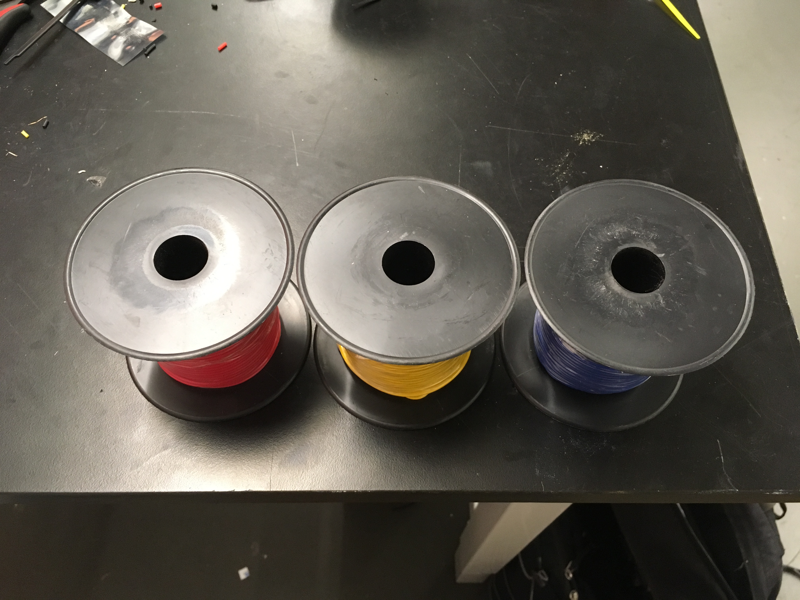

# Lab Equipment List {#build-lab-equipment status=ready}

This document contains a list of lab equipment we recommend having in your Makerspace.

## Soldering Iron
<figure>
    <figcaption>Soldering Iron</figcaption>
    
</figure>

**Description:** You will use the soldering iron to connect electrical components of the drone together.

## Solder
<figure>
    <figcaption>Solder</figcaption>
    
</figure>

**Description:** The soldering iron melts the solder so that electrical components can be connected.

## Solder Wool
<figure>
    <figcaption>Solder Wool</figcaption>
    
</figure>

**Description:** Used to clean the tip of the soldering iron.

## Soldering Fan
<figure>
    <figcaption>Soldering Fan</figcaption>
    
</figure>

**Description:** The soldering fan sucks up the smoke made when the solder melts so that you do not inhale it.

## Helping Hands
<figure>
    <figcaption>Helping Hands</figcaption>
    
</figure>

**Description:** Useful for holding components in place when soldering.

## Wire Snips
<figure>
    <figcaption>Wire Snips</figcaption>
    
</figure>

**Description:** Used to cut wires.

## Wire Strippers

<figure id="fig:wire-strippers">
    <figcaption>Wire Strippers</figcaption>
    
</figure>

**Description:** Used to remove the nonconductive casing from the end of a wire so that the wire can be soldered to a component.

## Heat Gun
<figure>
    <figcaption>Heat Gun</figcaption>
    
</figure>

**Description:** Blows hot air so that heat shrinks can shrink over a solder joint.

## Pliers
<figure>
    <figcaption>Pliers</figcaption>
    
</figure>

**Description:** Useful for holding wires and securing standoffs.

## Philips Screw Driver
<figure>
    <figcaption>Philips Screw Driver</figcaption>
    
</figure>

## 2.5 mm Allen Wrench
<figure>
    <figcaption>2.5 mm Allen Wrench</figcaption>
    
</figure>

**Description:** Used to secure screws on drone.

## Double Sided Mounting Tape
<figure>
    <figcaption>Double Sided Mounting Tape</figcaption>
    
</figure>

**Description:** Used to attach the camera and flight controller to the drone.

## Wire for ESCs
<figure>
    <figcaption>Wire for ESCs</figcaption>
    
</figure>

**Description:** Wire that will be soldered to the ESCs so that they can be connected to the motors.

## Wire for Pi Hat
<figure>
    <figcaption>Wire for Pi Hat</figcaption>
    
</figure>

**Description:** Used to connect components on the Pi Hat.
**The wires for ESC are thicker than the wires for pi Hat **

## Hot Glue Gun
<figure>
    <figcaption>Hot Glue Gun</figcaption>
    
</figure>

**Description:** Used to secure mini USB connector to the flight controller.

## Electrical Tape
<figure>
    <figcaption>Electrical Tape</figcaption>
    
</figure>

**Description:** If you accidentally burn the casing of a wire with the soldering iron, you can protect the wire by wrapping it in electrical tape.

## Multimeter
<figure>
    <figcaption>Multimeter</figcaption>
    
</figure>

**Description:** Used to test the connection and voltage across components on your drone. This tool will be used to confirm you correctly completed steps of the build.

