# Parts and Materials List {#build-assignment-2 status=ready}

This document contains a list of parts and materials needed to build a drone. Every item is included in a drone kit, unless specified otherwise.
 
## **FPV250 Drone Frame**
<figure>
    
</figure>

**Units:** 1  
**Description:** A 250mm plastic racing quad frame. Included in the frame box.

## **Power Distribution Board (PDB)**
<figure>
    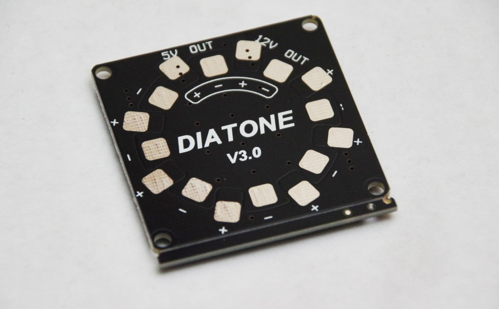
</figure>  
 
**Units:** 1  
**Description:** An electronic component that distributes power that it receives to other components connected to it. Included in the frame box.

## **XT60 Connector** + **Protective Casing** + **12AWG Red Wire** + **12AWG Black Wire**
<figure>
    
</figure>  
   
**Units:** 1 + 1 + 1 + 1

**Description:** When put together, makes a power connector cable that transfers power it receives.

## **2205 2300KV Brushless Motor**
<figure>
    
</figure>  

**Units:** 4 (2 clockwise and 2 counterclockwise)  
**Description:** An actuator that spins at variable RPM based on how much power it receives. Note that the motor direction (CW or CCW) specifies only the *nut threading*, not the direction of spin; both CW and CCW motors can spin bidirectionally.

## **5040 3-Blade Propeller**
<figure>
    
</figure>  
  
**Units:** 4 (2 clockwise and 2 counterclockwise, paired with motors)   
**Description:** A device with blades that turns rotational motion into thrust. 5 refers to the diameter in inches, and 4 refers to the distance the propeller would travel if turned one rotation without slippage, e.g. in jello. Three blades gives more lift for a given diameter than two blades - at the cost of efficiency.

## **30A Brushless Electronic Speed Controller (ESC)**
<figure>
    
</figure>  
  
**Units:** 4    
**Description:** An electronic component that sends variable amount of power to a motor, based on a specified input signal. Every motor needs one ESC.

## **2.0mm Bullet Connector**
<figure>
    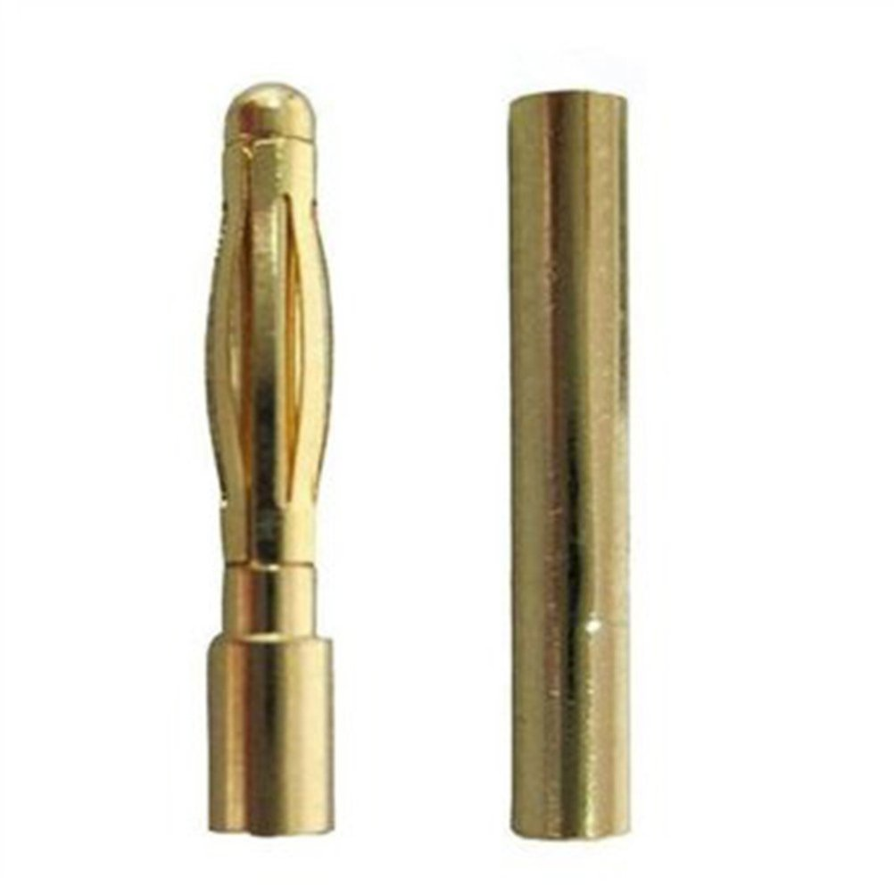
</figure>  
  
**Units:** 24 (12 male and 12 female)    
**Description:** On the left is a male connector and on the right is a female connector. A male connector can be inserted into a female connector to complete an electric connection.

## **6mm + 4mm Brass Standoff** 
<figure>
    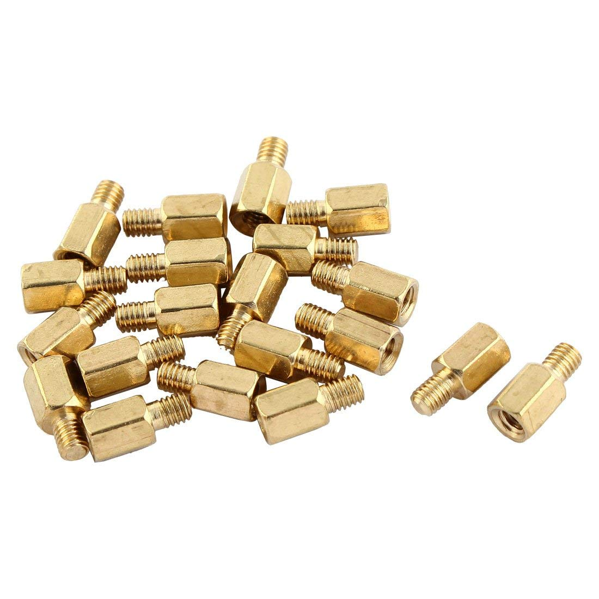
</figure>  

**Units:** 6    
**Description:** A special type of screw that can also accept other screws.

## **M3 Black Bolt**
<figure>
    
</figure>  
 
**Units:** 12-16   
**Description:** A screw that can be screwed into a standoff or a motor. Included in the motors box.

## **Raspberry Pi 3 Model B (Pi)**
<figure>
    
</figure>  

**Units:** 1   
**Description:** A single board computer that can execute code loaded via an SD card.

## **16GB Micro SD Card**
<figure>
    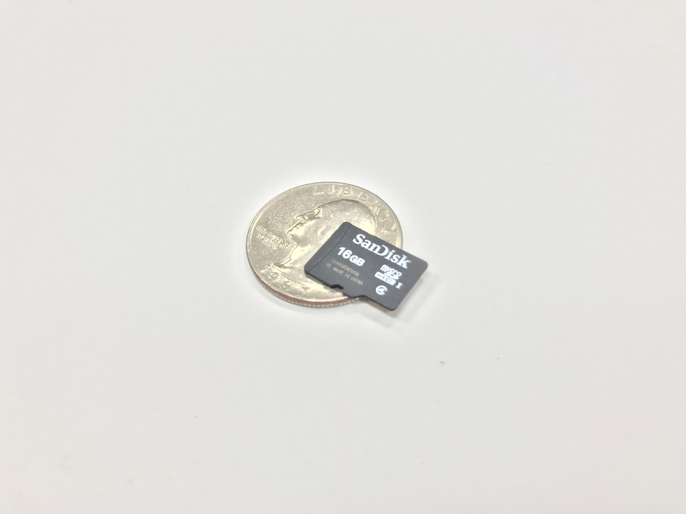
</figure>  

**Units:** 1   
**Description:** A memory device, especially notable because it can store code and be inserted into a Pi.

## **Heat Sink**
<figure>
    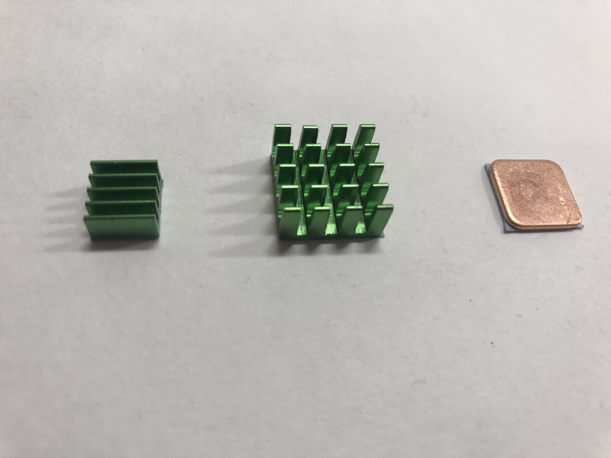
</figure>  

**Units:** 3 (14mm * 14mm * 7mm; 9mm * 9mm * 5mm; 12mm * 12mm * 1mm)    
**Description:** A device that dissipates heat into the air. When attached to a Pi, it will regulate temperature at optimal levels.

## **Pi Mount**
<figure>
    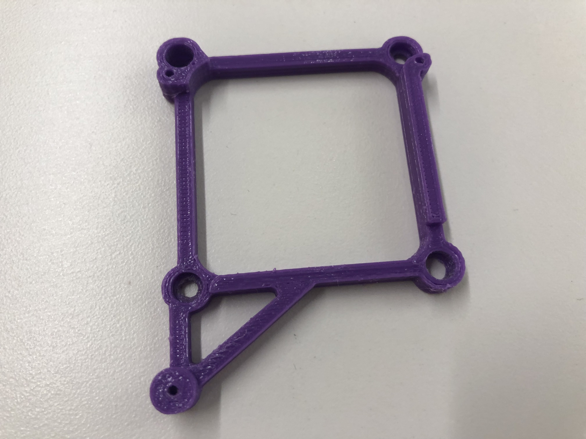
</figure>  
 
**Units:** 1   
**Description:** A 3D-printed mount for attaching the Raspberry Pi to the drone frame. 

## **Screws for Pi to Pi Mount**
<figure>
    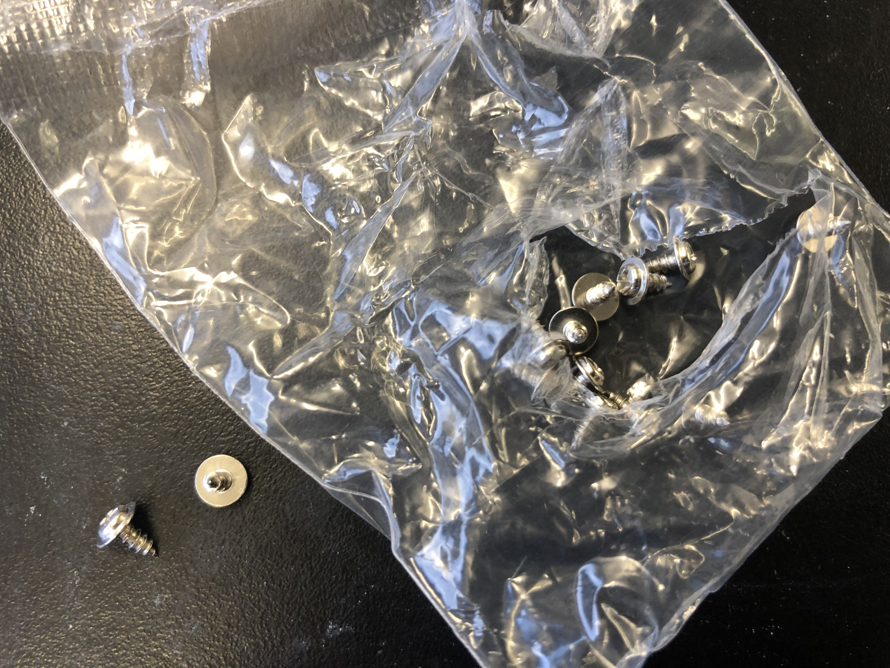
</figure>  
 
**Units:** 3    
**Description:** Small screws for mounting the Pi on top of the pi mount. Included in the frame box.

## **Battery Eliminator Circuit (BEC)**
<figure>
    
</figure>  
 
**Units:** 1   
**Description:** An electronic component that transforms high power into low power (in technical terms, performs a *voltage drop*). 

## **Flight Controller (FC)**
<figure>
    
</figure>  
  
**Units:** 1   
**Description:** A device that contains a few sensors: an Inertial Measurement Unit (IMU) and a gyroscope; an IMU measures linear accelerations and a gyroscope measures angular velocities. A flight controller can also send input signals to an ESC.

## **USB to Micro USB**
<figure>
    
</figure>  
 
**Units:** 1   
**Description:** A cable that connects the flight controller to the Pi.  

## **Arducam 5 Megapixels 1080p OV5647 Camera (Pi Cam)**
<figure>
    
</figure>  
  
**Units:** 1   
**Description:** A sensor that observes 2D images of the world and reports it on a thin strip.

## **Infrared Sensor (IR)** + **IR Sensor Cable**
<figure>
    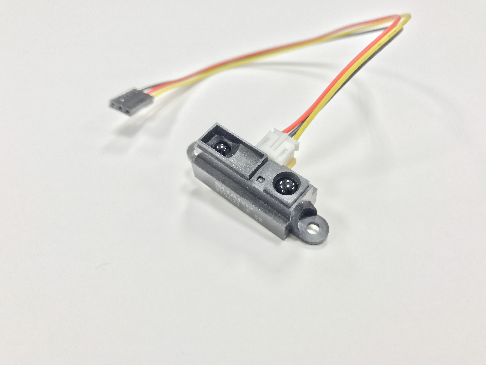
</figure>  
  
**Units:** 1   
**Description:** A sensor that measures distance to an object using infrared beams, then reports it on a cable.

## **Perma-Proto Raspberry Pi Hat (Pi Hat)**
<figure>
    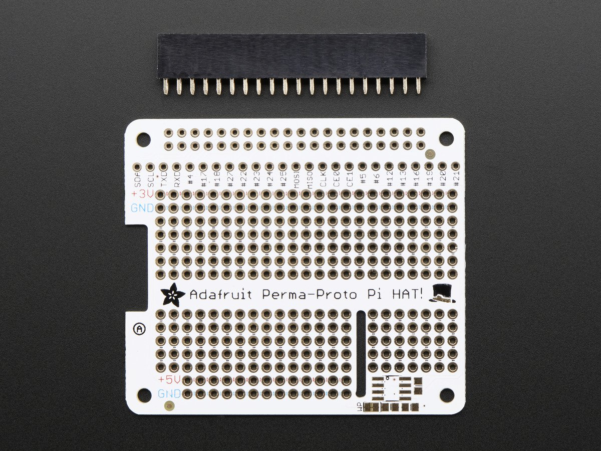
</figure>  
 
**Units:** 1    
**Description:** A breadboard specifically designed for easy attachment to a Pi.

## **Adafruit Analog-to-Digital Converter (ADC)**
<figure>
    
</figure>  
   
**Units:** 1    
**Description:** A device that converts real-valued signals (i.e. analog) into discrete-valued signals (i.e. digital).

## **1500mAh 3S 20C LiPo Battery**
<figure>
    
</figure>  
 
**Units:** 1   
**Description:** A lithium polymer battery used to power the drone. 

## **12V 2-3S LiPo Charger** + **AC/DC US Charge Adapter**

| LiPo Charger     |  Charge Adapter            |
|:-------------------------:|:-------------------------:|
|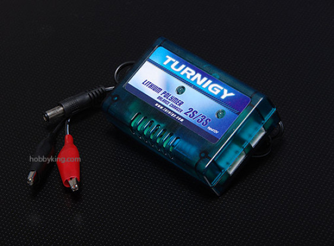  |   |

**Units:** 1 + 1   
**Description:** A charger used to charge a LiPo battery. A charger adapter is needed in order to plug the charger into a wall outlet.

## **Velcro**
<figure>
    
</figure>  
 
**Units:** 1    
**Description:** A velcro strip used to hold the battery to the drone.                     

## **Heat Shrinks** (not included)
<figure>
    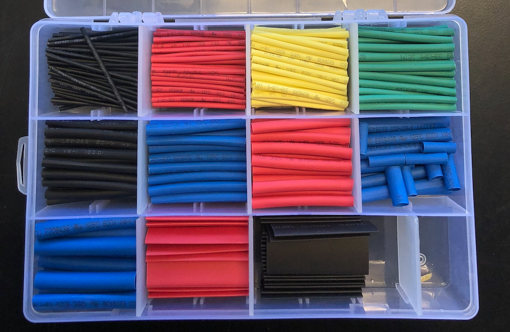
</figure>  
       
**Description:** A heat shrink (a.k.a heatshrink or heat-shrink tubing) is a shrinkable plastic insulator tube used to insulate wires. It is commonly used as a "sleeve" over a solder joint.

## **Zip Ties** (not included)
<figure>
    
</figure>  
       
**Description:** A zip tie is a type of fastener for holding items together, primarily electrical cables or wires.     
