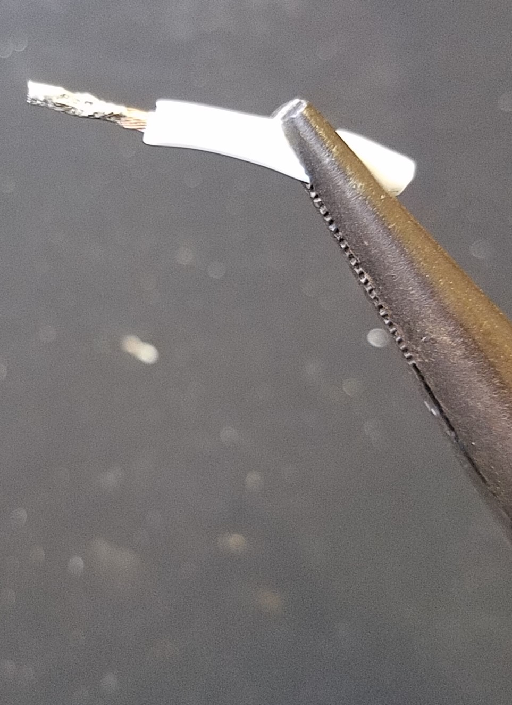
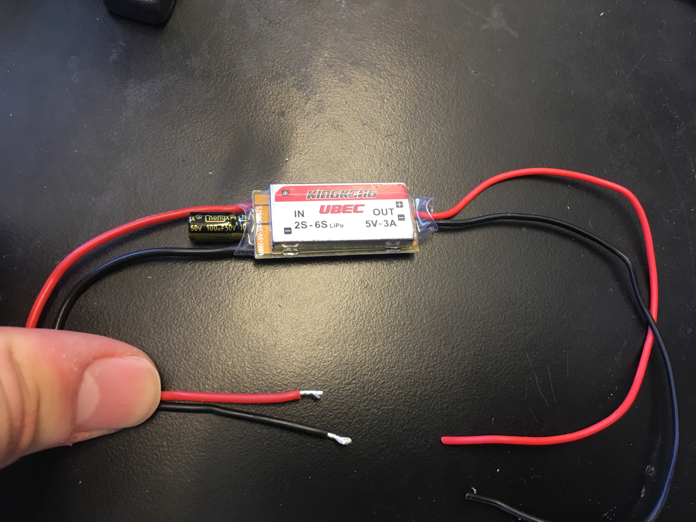
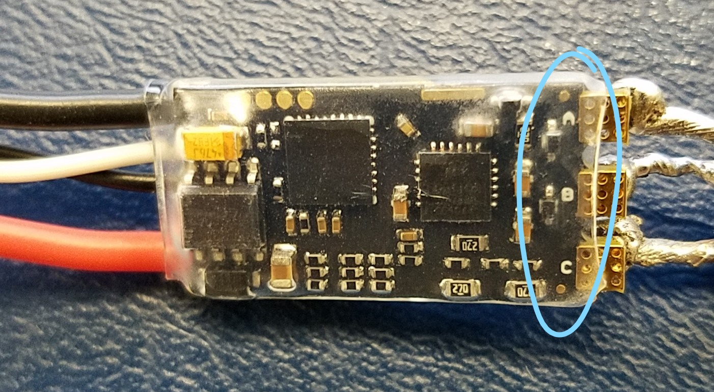
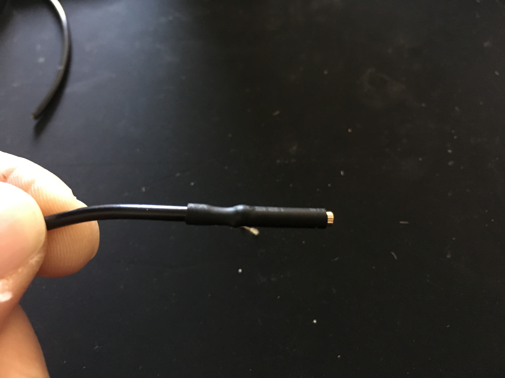
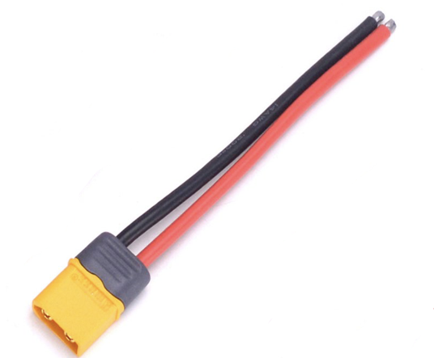

# Phase 0: Prep Work {#build-phase0 status=ready}

**Expected Time**: 4 hours

## Preface

Before you begin, please ensure you have all the parts in the [parts and materials list](https://docs-brown.duckietown.org/books-brown/opmanual_sky/out/build_parts_and_materials.html).

In this phase of the build, you will do prep work for the next phases of the build. This phase will require a lot of soldering, so please go through a [soldering tutorial](https://www.youtube.com/watch?v=Qps9woUGkvI) before starting.

**Safety Tips:**

- Be careful holding wires and components with your bare hands while soldering, as they will get very hot very quickly. We recommend using long-nose pliers or helping hands whenever possible.

- Don't touch the soldering iron tip (or any other metal piece) while the soldering iron is on, since doing so can cause burns. If you get burned, rinse the affected area with cold water immediately. 
   
- Likewise, don't use the soldering iron on anything you don't intend to solder. The high heat will cause things to melt or burn.

- Don't breathe soldering fumes; use a soldering fan whenever possible.

- If you have difficulty soldering (e.g. shaky hands), please seek the advice of a TA or teacher.

## Strip and Tin Wires

**Stripping** is the process of removing a portion of insulator from a wire in order to expose its strands. It is done by using a wire stripper.    

| An unstripped wire        |  A stripped wire          |
|:-------------------------:|:-------------------------:|
|  |   |

**Tinning** is the process of applying solder to exposed wire. It is done by using a soldering iron to melt solder into the exposed wire.    

| A wire before tinning     |  A tinned wire            |
|:-------------------------:|:-------------------------:|
|  |   |

The purpose of stripping and tinning wires is to allow them to be joined together. By itself, stripping would not allow wires to be joined because the exposed wires would have no way to "stick" to each other.

However, tinning *does* allow exposed wires to "stick" (i.e. join) to each other by using the fact that solder turns into a liquid when exposed to high heat, but into a solid when the heat is removed; this means wires can be joined by:

1. Putting the tinned wires next to each other so they are touching.

2. Heating solder on both wires simultaneously so each turns into a liquid. The liquids will then combine.

3. Removing the heat so the liquid solidifies, thus joining the two wires.

See this [tutorial](https://www.youtube.com/watch?v=pRPF4wpXX9Q) to learn how to tin and join two wires.

An alternate way to tin a wire would be to wrap the wire with solder, then melt with a soldering iron:

| A wire before tinning     |  A tinned wire            |
|:-------------------------:|:-------------------------:|
|  |   |

Furthermore, since solder is conductive, the resulting joint acts as a bridge for electricity traveling between the connected wires! 

**Action Items:** 

- In this phase, strip and tin all of your parts, so that in latter phases they can be joined together.  

**NOTE:**

- Only tin red and black wires on the IN side of BEC.

- Do **not** substitute the red and brown wire pair in flight controller box with any other wire pair in the box.

| Part Name                 | Amount                    |  After Tinning Picture    |
|:-------------------------:|:-------------------------:|:-------------------------:|
| ESC                       | 4                         |   |
| Motor                     | 4                         |   |
| BEC                       | 1                         |   |
| Red and brown wire pair in flight controller box | 1                         |   | 

## Solder wires onto ESC pads

In this section, you will prepare your ESCs.

1. Gather the following parts: 
    * 4 ESCs
    * Heat Shrinks (recommend 13mm width)
    * 12 pieces of wire (recommend 4 red, 4 yellow, and 4 blue - each 3in. length)

2. For each ESC:
    1. Use your fingers (or small wire cutters) to *very carefully* remove excess material from each ESC pad.

   | Excess material on ESC pads | After removal excess material |
   |:-------------------------:|:-------------------------:
   |  | 

    2. Solder the following:
        * 1 red wire on pad A
        * 1 yellow wire on pad B
        * 1 blue wire on pad C

        **NOTE:** the wire colors are purely our convention. Feel free to use other colors if needed.

        <figure>
	    <figcaption>Pad letters</figcaption>
    	    
   	    </figure>
   
    3. Do a [connectivity check](https://docs-brown.duckietown.org/books-brown/opmanual_sky/out/build_multimeter.html) between each pair of soldered wires (recommend doing this now instead of in checkoff later).  

    4. Put a heat shrink over the ESC. The heat shrink should cover (length-wise) the exposed soldered wires on one end and half the ESC on the other end. Apply heat to shrink the heat shrink.
   
   | A Prepared ESC | A Prepared ESC with heat shrink |
   |:-------------------------:|:-------------------------:
   |  |    
   
    5. Strip and tin all wires of the completed ESC (if not already done).

## Solder bullet connectors

  Before beginning this section, please refer to a bullet connector soldering [tutorial](https://www.youtube.com/watch?v=u--Kvz8hksE).

  **NOTE:** You can use any setup to hold the bullet connector, so long as the setup is not thermally conductive.

<ol>
  <li>Gather the following parts:
    <ul>
      <li>4 completed ESCs</li>
      <li>4 motors</li>
      <li>12 bullet connectors, female</li>
      <li>12 bullet connectors, male</li>
      <li>Heat shrinks (recommend 4mm in width)</li>
    </ul>
  </li>
  <li>For each ESC:
    <ol>
      <li>
        

           Solder a female bullet connector to each of the 3 ESC wires (i.e. red, yellow, blue).
        

        <figure>
          <figcaption>Female bullet connectors on ESC wires (here the wires are black instead of red, yellow, and blue)</figcaption>
          
        </figure>  
      </li>
      <li>
        

          Put a heat shrink over each solder joint. For female connectors: the heat shrink should cover the solder joint on one end and run the entire length of the bullet connector. Apply heat to shrink the heat shrink.
        

        <figure>
          <figcaption>Female bullet connect with heat shrink</figcaption>
          
        </figure>
      </li>
    </ol>
  </li>
  <li>For each motor:
    <ol>
      <li>
        

           Solder a male bullet connector to each of the motor's wires.
        

        <figure>
          <figcaption>Male bullet connectors on motor wires</figcaption>
          
        </figure>  
      </li>
      <li>
        

          Put a heat shrink over each solder joint. For male connectors: the heat shrink should cover the solder joint on one end and run only the short length of the cylindrical part. Apply heat to shrink the heat shrink.
        

        <figure>
          <figcaption>Male bullet connector with heat shrink</figcaption>
          
        </figure>    
      </li>
    </ol>
  </li>
</ol>

## Create an XT60 Connector Cable
Please skip this step if your kit already contains a completed XT60 connector cable:

<figure>
    <figcaption>Completed XT60 Connector</figcaption>
    
</figure>  

1. Gather the following parts:

    - XT60 connector (Female)

    - Protective casing for XT60 connector (optional)

    - 12AWG red wire, 12AWG black wire

    - Heat shrinks (recommend 5mm-9mm width)
    
    <figure>
    <figcaption>Parts of XT60 connector</figcaption>
    
    </figure>  
    
2. Follow this [guide](http://www.mindsensors.com/blog/how-to/tutorial-soldering-xt60-connectors) on creating an XT60 connector cable.

3. Slide the protective casing through the red and black wires, then attach to XT60 connector (optional).

4. Strip and tin all wires of the completed XT60 connector cable (if not already done).

## Checkoff

- Visually inspect each ESC and verify that the heat shrinks are on properly; there should be no exposed wires and each heat shrink should be a tight fit.

- Visually inspect that each of the following is stripped and tinned: 4 ESCs, 4 motors, BEC, XT60 connector, red and brown wire pair.

- Do a [connectivity check](https://docs-brown.duckietown.org/books-brown/opmanual_sky/out/build_multimeter.html) on the XT60 connector cable; verify there is no short between the red and black wire.

- Do a [connectivity check](https://docs-brown.duckietown.org/books-brown/opmanual_sky/out/build_multimeter.html) on each ESC; for each ESC, verify there are no shorts between any two wires you soldered.
