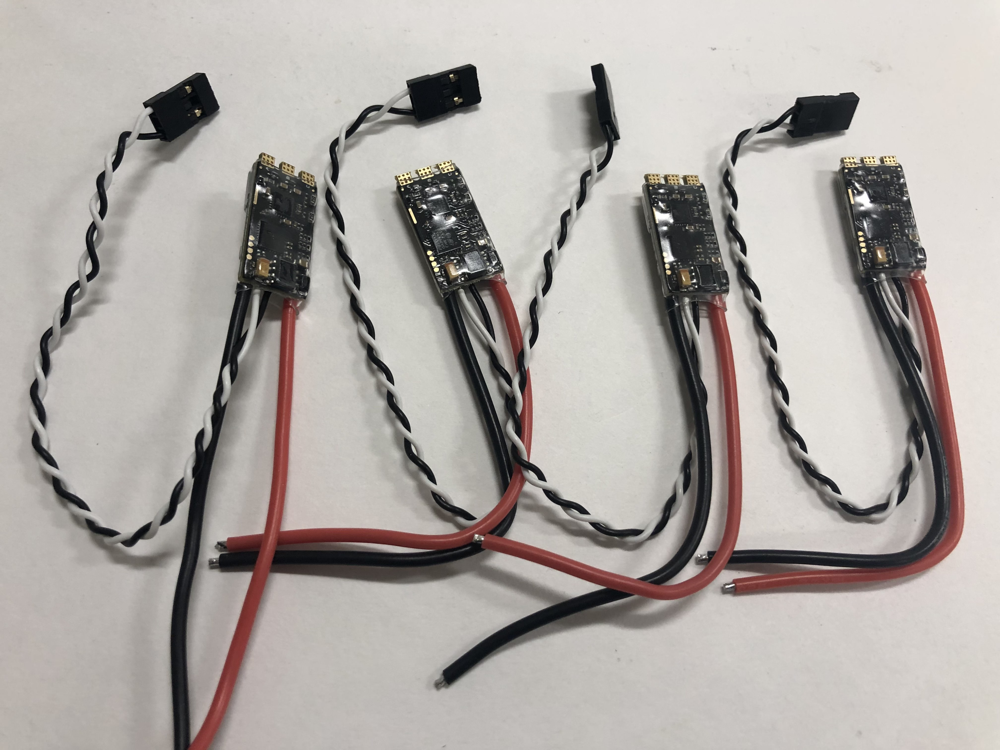
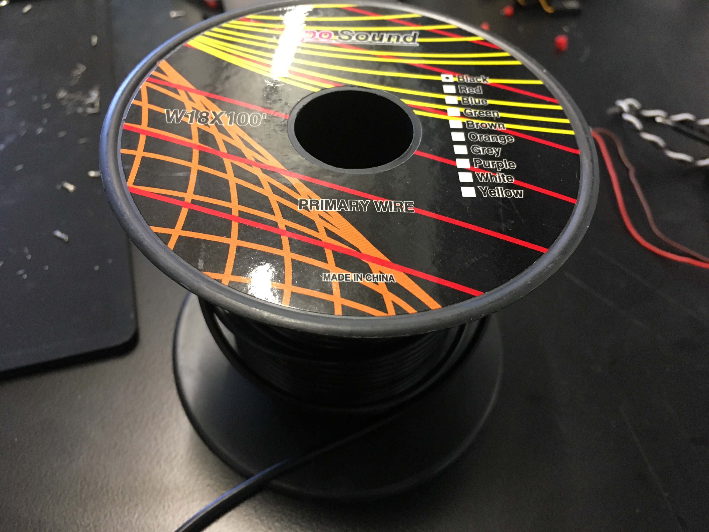

# Equipment List {#build-assignment-2 status=ready}

Here you will learn about the tools and materials that you will need to use to build your drone. This equipment can be found in your lab space.

## Soldering Iron
<figure>
    <figcaption>Soldering Iron</figcaption>
    
</figure>  
 
**Description:** You will use the soldering iron to connect electrical components of the drone together. 

## Solder
<figure>
    <figcaption>Solder</figcaption>
    
</figure>  
 
**Description:** The soldering Iron melts the solder so that electrical components can be connected. 

## Solder Wool
<figure>
    <figcaption>Solder Wool</figcaption>
    
</figure>  
 
**Description:** Used to clean the tip of the soldering iron.

## Soldering Fan
<figure>
    <figcaption>Soldering Fan</figcaption>
    
</figure>  
 
**Description:** The soldering fan sucks up the smoke made when the sodlering melts so that you do not inhale it.

## Halping Hands
<figure>
    <figcaption>Helping Hands</figcaption>
    
</figure>  
 
**Description:** Useful for holding components in place when soldering.

## Wire Snips
<figure>
    <figcaption>Wire Snips</figcaption>
    
</figure>  
 
**Description:** Used to cut wires.

## Wire Strippers
<figure>
    <figcaption>Wire Strippers</figcaption>
    
</figure>  
 
**Description:** Used to remove the nonconductive casing from the end of a wire so that the wire can be soldered to a component.

## Heat Shrinks
<figure>
    <figcaption>Heat Shrinks</figcaption>
    
</figure>  
 
**Description:** Protective material that is put over soldering joints. The material shrinks when exposed to high heat.

## Heat Gun
<figure>
    <figcaption>Heat Guns</figcaption>
    
</figure>  
 
**Description:** Blows hot air so that heat shrinks can shrink over a solder joint.

## Pliers
<figure>
    <figcaption>Pliers</figcaption>
    
</figure>  
 
**Description:** Useful for holding wires and securing standoffs.

## Zip Ties
<figure>
    <figcaption>Zip Ties</figcaption>
    
</figure>  
 
**Description:** Used to secure the infrared sensor, PWM connectors, and ESCs to the frame of the drone.

## 2.5 mm Allen Wrench
<figure>
    <figcaption>2.5 mm Allen Wrench</figcaption>
    
</figure>  
 
**Description:** Used to secure screws on drone.

## Double Sided Mounting Tape
<figure>
    <figcaption>Double Sided Mounting Tape</figcaption>
    
</figure>  

**Description:** Used to attach the camera and flight controller to the drone.

## Wire for ESCs
<figure>
    <figcaption>Wire for ESCs</figcaption>
    
</figure>  

**Description:** Wire that will be soldered to the ESCs so that they can be connected to the motors.

## Hot Glue Gun
<figure>
    <figcaption>Hot Glue Gun</figcaption>
    
</figure>  

**Description:** Used to secure mini USB connector to the flight controller.

## Hot Glue Gun
<figure>
    <figcaption>Hot Glue Gun</figcaption>
    
</figure>  

**Description:** Used to secure mini USB connector to the flight controller.

## Electrical Tape
<figure>
    <figcaption>Electrical Tape</figcaption>
    
</figure>  

**Description:** If you accidentally burn the casing of a wire with the soldering iron, you can protect the wire by wrapping it in electrical tape.
