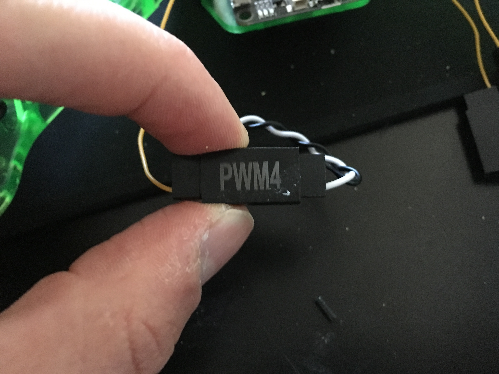
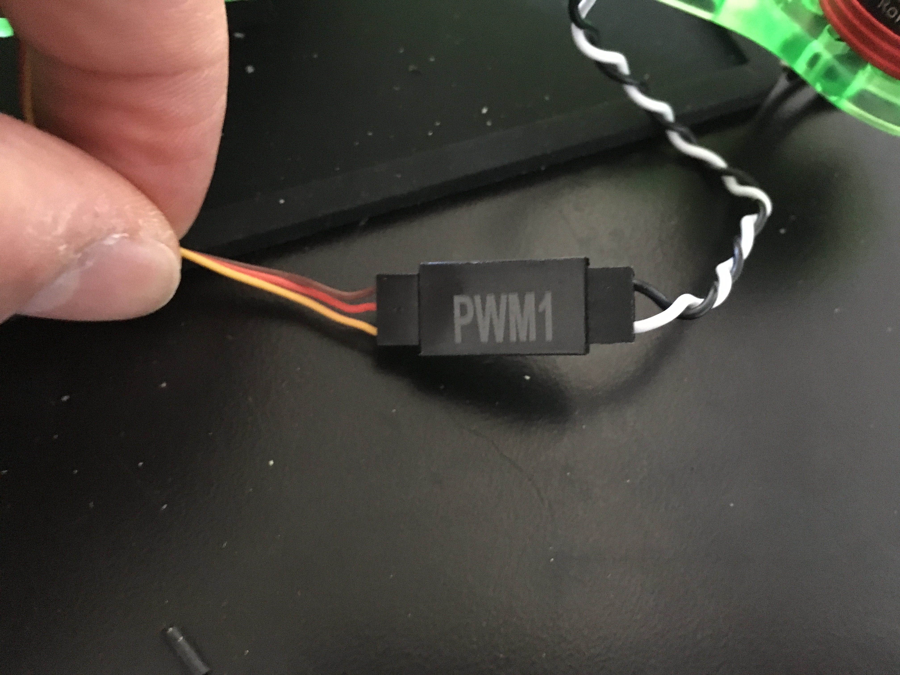

# Phase 3: Device Configuration {#build-phase3 status=ready}

**Expected Time**: 1 hour

## Preface

In this phase of the buid, you will configure and calibrate the drone's devices. This includes:

- Flashing your SD card with our software stack
- Configuring the flight controller for our desired mode of operation
- Calibrating the ESCs with respect to the flight controller

The flight controller will receive roll, pitch, yaw, and thrust instructions from the drone's computer and send corresponding electrical signals to the ESCs (i.e. *PWM signals*). The ESCs will use those signals to send variable amounts of power to the motors. Then, the motors will spin in such a way so that the desired roll, pitch, yaw, and thrust are achieved. The flight controller knows what signals to send to the ESCs because it has an **IMU** (i.e. Inertial Measurement Unit), which measures the roll, pitch, and yaw of the drone.

## Flashing Your SD Card

In order for the drone to operate autonomously, it must have an intelligent system in place which dictates what to do. Our software stack will be such a system, which we will load into the drone's computer using an SD card.

1. Gather the following:
    - A workstation (or personal computer)
    - Micro SD card
    
2. On a workstation, downlaod the image flashing tool [Etcher](https://www.balena.io/etcher/).

3. On a workstation, download the latest drone [image](https://drive.google.com/file/d/1ogPrxXBpXa6Tbv3xpYZcvCc_7EXD-w7S/view?usp=sharing).

4. Connect the micro SD card to the workstation.

5. Open Etcher and select the downloaded drone image. Then select the micro SD card as the drive to flash. Finally, click the "Flash" button.

## Flashing the Flight Controller

Before the FC can be configured, it must first be flashed with firmware. **Firmware** is a special type of software that allows hardware to be controlled programmatically. Once the FC is flashed, a program called **Cleanflight** can be used to configure it.

On top of the flight controller, there are two holes marked "boot". Take a short piece of wire that is stripped on both sides and connect the two holes with the wire as shown below:

<figure>
    <figcaption>Flight controller with jumped bootloader wire</figcaption>
    
</figure>  

Next, plug your flight controller with the jumped bootloader wire into a computer with Cleanflight installed, using a USB cable. Open up Cleanflight.

Click on "Firmware Flasher" on the left sidebar. 

<figure>
    <figcaption>Firmware Flasher</figcaption>
    
</figure>  

Make sure "No reboot sequence", "Flash on connect", and "Full chip erase" are checked. Next, click on "Load Firmware \[Local\]" in the bottom right corner of the window. Then, select your custom fireware file.

<figure>
    <figcaption>Fireware Flasher</figcaption>
    
</figure>  

Click on the "flash firmware" button.

<figure>
    <figcaption>Flash Firmware</figcaption>
    
</figure>  

<figure>
    <figcaption>Flashing</figcaption>
    
</figure>  

Wait until the bar at the bottom of the screen says "Programming: SUCCESSFUL". The firmware is flashed.    
**NOTE:** If the bar instead says "Verifying: FAILED" and the only half of the bar is filled, that is fine too.     

## Configuring Your Flight Controller

Remove the bootloader wire from your flight controller. Then, click the "Connect" button in the top right corner of the screen.

<figure>
    <figcaption>Connect to Cleanflight</figcaption>
    
</figure>  

Go to "Ports" tab and make sure SerialRX for UART2 is disabled and click "Save and Reboot." UART2 is a pin on the flight controller, and we want to make sure it only uses the USB.

<figure>
    <figcaption>Ports Config</figcaption>
    
</figure>

Go to "Configuration" tab. 

Change the ESC/Motor protocol to "MULTISHOT".

<figure>
    <figcaption>Multishot</figcaption>
    
</figure>  

Set the Minimum Throttle to 1100.

<figure>
    <figcaption>Set Minimum Throttle</figcaption>
    
</figure>  

Flip the yaw by 180 degrees and click "Save and Reboot." This is because we mount the flight controller the opposite direction in order to leave the USB port free to plug into the Raspberry Pi.

<figure>
    <figcaption>Flip Yaw</figcaption>
    
</figure>  

Also change the receiver to "MSP RX input" and click "Save and Reboot." By default it is configured to receive data from an RC receiver, but we want it to take commands over MSP. 

<figure>
    <figcaption>MSP RX Input</figcaption>
    
</figure>  

On the configuration page, Cleanflight might say that the direction of your motors are reversed. This is a UI bug in some versions of Cleanflight. You will ensure that your motors are spinning in the right direction soon.

We need tell it to be in Angle mode for the entire range (and not acrobatic mode). Go to the "Modes" tab i. Under "Angle", click "Add Range."

<figure>
    <figcaption>Angle Mode</figcaption>
    
</figure>  

Drag the sliders so that the range spans from 900 to 2100. (The entire range.) 

<figure>
    <figcaption>Expand Range</figcaption>
    
</figure>  

<figure>
    <figcaption>Expanded Range</figcaption>
    
</figure>  

Click "Save".

We need to change the PID parameters to ones that work better on our drone. Go to the "PID Tuning" tab. Change the "ROLL" and "PITCH" PID terms to match the image. Roll should be (Proportional: 60, Integral: 40, Derivative: 50, RC Rate: 1.00, Super Rate: 0.00, Max Vel: 200). Pitch should be (Proportional: 60, Integral: 40, Derivative: 50, RC Rate: curly bracket, Super Rate: 0.00, Max Vel: 200)

<figure>
    <figcaption>PID Params</figcaption>
    
</figure>  

Change angle limit to 50. 

<figure>
    <figcaption>Set Angle Limit</figcaption>
    
</figure>  

Click "Save."

## Connecting the ESCs to the Flight Controller

The numbers corresponding to each motor are as shown. Recall that the camera is in the back of the frame and the flight controller is in the front.

<figure>
    <figcaption>Motor Numbers</figcaption>
    
</figure>  

The yellow cable coming out of the skyline has 6 numbered connectors. Plug each motor into the corresponding connector (1-4) according to the above numbering scheme. The connectors shouldn't be too easy to plug in backwards, but make sure the white wire from the ESC is in line with the yellow wire in the connector from the skyline. The other 2 wires PWM 5/6 can be cut off. 

<figure>
    <figcaption>Connecting PWMs</figcaption>
    
</figure>  

<figure>
    <figcaption>Connecting PWMs</figcaption>
    
</figure>  

## Test the motors

This is the first time you will be firing up your drone! At this point, make sure there is nothing that could be potentially causing a short on your PDB. Take a battery and plug it into the XT60 connector. If you did everything right, lights should come on and the motors beep. If this doesn’t happen, unplug the battery immediately! It is likely the case that something is backwards or shorting, and you could be causing damage by applying a voltage.

Now plug in the Skyline to your computer via USB and connect to the Cleanflight configurator.

i. Go to the Motors tab in Cleanflight. Make sure the props are off! 

ii. Read the safety notice and check the box that says “I understand the risks, propellers are removed - Enable motor control.” 

iii. Slowly power up each motor. Verify first that the correct motor spins and second that it spins in the correct direction using the diagram below. 

iv. If the motor does not spin, verify the connections, make sure there are no shorts and that it has power. 

<figure>
    <figcaption>Motor Directions</figcaption>
    
</figure>  

v. If a motor spins in the wrong direction, make a note of which motor it is. Power your drone off by disconnecting the battery or power supply. unplug the USB connector from the computer. To reverse the direction of a motor (to make it spin in the right direction), swap the connection of two bullet connectors for that motor.

Connect the drone to power again and plug it into the computer. Reconnect to Cleanflight and ensure that your drone's motors are spinning in the correct direction.

## Calibrate your ESCs

This configuration tells the ESC at what PWM to start spinning up the motor. If you do not do it, the ESCs will not all work together to allow the drone to fly stably. Symptoms that this needs to be done include hot motors, a drone that lists to one side, or motors that appear to spin at different speeds.

There appears to be a software bug in Cleanflight that causes this calibration process to switch the motor directions, so make sure you follow all steps and make sure the motors are spinning in the right direction when you finish.

1. **REMOVE ALL PROPELLERS.**    

2. Connect the flight controller to computer, then open up CleanFlight.

3. Go to Motors tab.

4. Unplug the battery from the drone.

5. Toggle on "Motor Test Mode Notice". **MAKE SURE ALL PROPELLERS REMOVED!**    

6. Drag master slider up to full. All 4 motor sliders should move up to full accordingly (i.e. 2000).

7. Plug the battery into the drone

8. ESCs will make an interesting set of sounds, kind of like music. If they do not, stop and try the previous steps again.
After the music stops, click on the bottom end of the master slider bar. The master slider should now be at the bottom of the bar. Correspondingly, all 4 motor sliders should be at the bottoms of their bars (i.e. 1000). 1.. The motors will make another set of sounds.

9. After the sounds stop, spin up each motor one at a time. Make sure they are spinning in the right direction (i.e. according to the diagram).

10. Go to the Configuration tab. If the drone diagram is yellow and says "reversed", then toggle the "direction" slider below it to undo the reverse. The diagram should now be green, with each motor in the diagram having the expected spin direction. Click "save and reboot".

11. Unplug from CleanFlight, reconnect everything to the drone, and power it on. **MAKE SURE THE PROPELLERS ARE REMOVED.** Arm the drone and make sure each motor is spinning in the desired direction (i.e. according to the green diagram).

## Checkoff

1. Make sure your motors spin the correct direction.
2. When you connect the drone to power, the ESCs make a "boop boop boop" sound, followed by a "beep BEEEEEP" sound.
