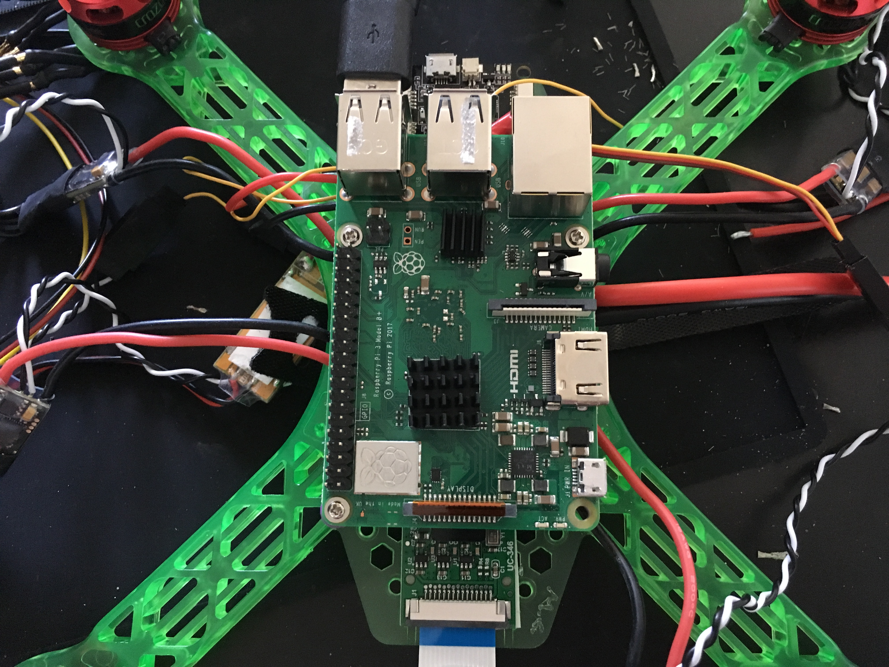

# Phase 4: Asssembly {#build-phase4 status=ready}

**Expected Time**: 30 minutes

## Preface

In this section of the build, you will complete the final assembly of your drone. Start charging your battery now so that 
you may use it to fly.

## Glue USB Connector to Flight Controller

Carefully plug the 6" USB cable into the USB port of the skyline. These 
little surface-mount USB micro ports are very prone to failure, so to minimize 
the likelyhood of ripping off the port or breaking a connection cover the USB connector 
thoroughly with hot glue. 
Yes, you will not be able to remove the USB cable. This is intentional.

| Glued USB Connector
|:-------------------------:
|
    

## Attach PiMount

Place the PiMount on top of the PDB and use the black screws to secure the mount to the standoffs. Ensure that the triangle shape is on the side of the camera.

| Securing the PiMount 
|:-------------------------:
|

## Put Heat Sinks on Raspberry Pi

You must put heat sinks on parts of the Raspberry Pi so that they do not overheat. Attach the heat sinks to the Pi as shown in the pictures. 

| Heat Sinks on Top of Pi 
|:-------------------------:
|

| Heat Sinks on Bottom of Pi
|:-------------------------:
|

## Attach Raspberry Pi

Use the sliver screws included with the frame kit to secure the Pi to the mount. You should use 3 screws as shown in picture. The USB ports should be toward the front of the drone.

| Securing the Pi
|:-------------------------:
|

## Pi Hat

With the Pi hat all soldered together place it on top of the Pi being sure the pins go into the Header holes.

### Camera

Also be sure to connect the camera before fully pressing down the Pi hat. Note the camera port on the pi is closer to the HDMI port.

### BEC

Attach the BEC to the top of the USB ports using some double sided tape.

## Ziptie ESCs and PWM Connectors to Frame Arms

Use the mini zipties to secure the ESCs, motor wires, and ESC wires to the bottom of the arms of the frame. Also, use zip ties to secure the PWM connectors to the top or sides of the frame.

| ESC and motor wires secured with zipties
|:-------------------------:
|

| PWM connector secured with zipties
|:-------------------------:
|

## Propellors

Finally! Attach the wings to the drone so that it may fly. Be aware that the bolts on the motors that spin counterclockwise tighten when turned counterclockwise, and the bolts on the motors that spin clockwise tighten when turned clockwise. Use a wrench to tighten the bolts down so that the bottom of the propellor is flat on the top of the motor. Screw bolts down tightly, but not so tight that you could not remove the propellors if you had to.

## Warnings

- Make sure ESC-motor wires are ziptied down properly. If not, you risk having a short.

- The propellors **must** be flat on the base of the motor.

## Checkoff

- Spin the propellors manually with your finger. Ensure no wires are hit by the propellors

- Make sure no wires or parts are dangling from the drone frame.

