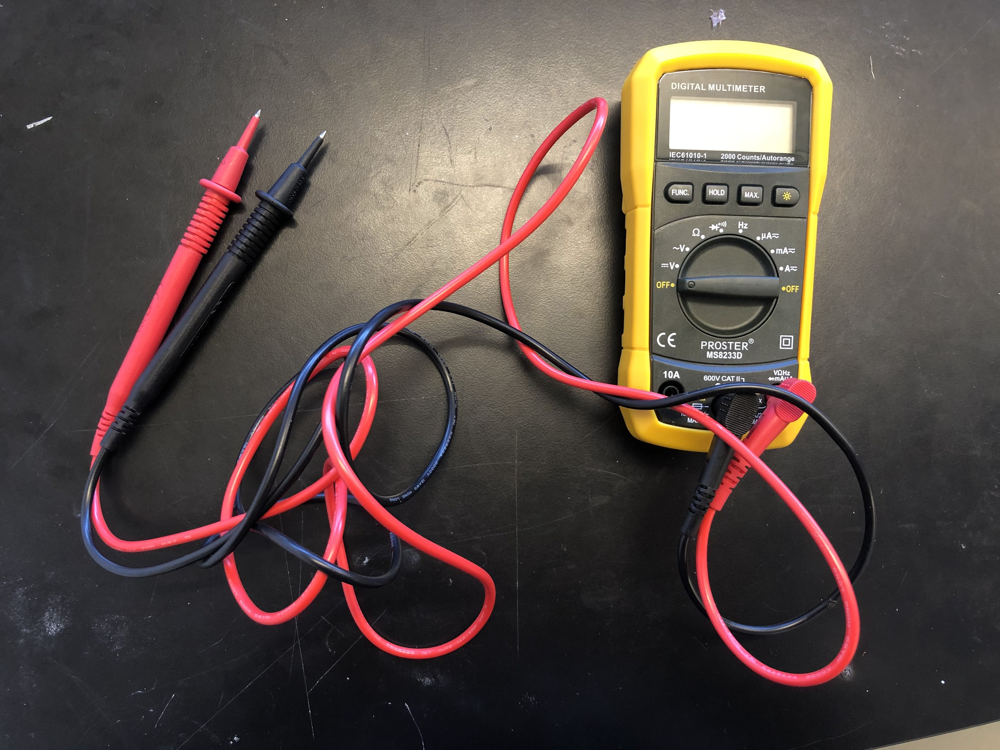
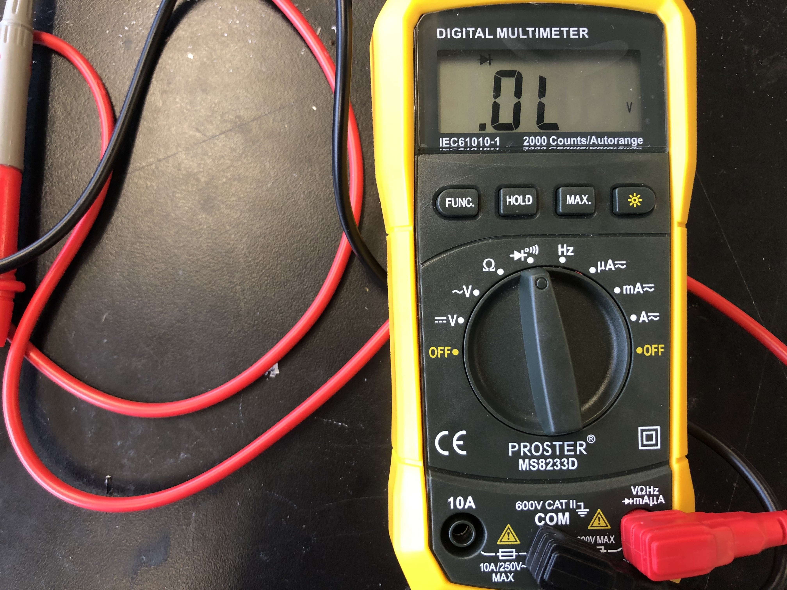
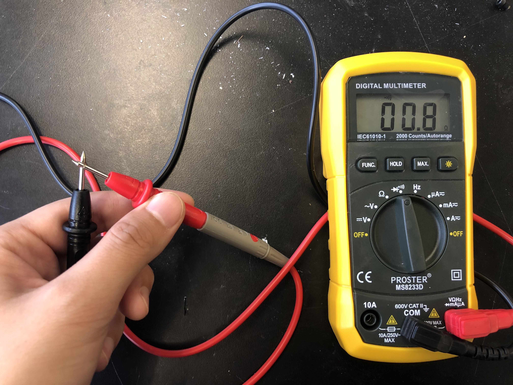
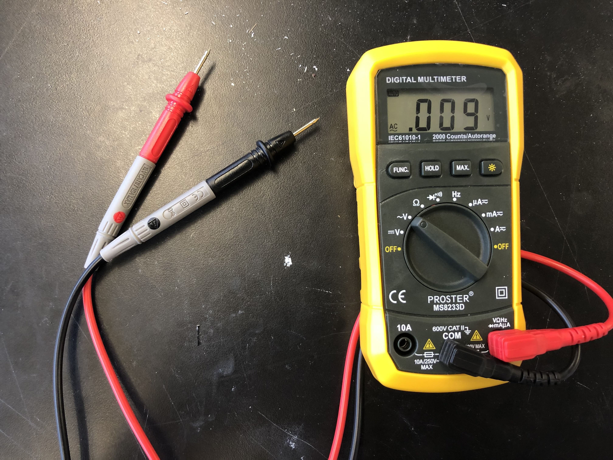

# How to Use Multimeters {#build-multimeter status=ready}

During this step you will learn about how to use multimeters to do a continuity check and a voltage check.    

A multimeter or a multitester, also known as a VOM (volt-ohm-milliammeter), is an electronic measuring instrument that combines several measurement functions in one unit. A typical multimeter can measure voltage, current, and resistance. [This](https://learn.sparkfun.com/tutorials/how-to-use-a-multimeter/all) is a general tutorial for multimeters.   
**NOTE:** Please turn off the multimeter by setting the dial to *OFF* after you finish your check.    

<figure>
    <figcaption>Multimeter</figcaption>
    
</figure>

## [**Continuity Check**](https://www.youtube.com/watch?v=5G622WDZaHg)

In electronics, a continuity test is the checking of an electric circuit to see if current flows (that it is in fact a complete circuit).

1. **Selecting the Continuity Function**   
* Switch the multimeter dial to the continuity test function (indicated by an icon that looks like a sound wave).  
<figure>
    <figcaption>Switch the Dial to the Continuity Test Function</figcaption>
    
</figure>

* Press "FUNC." button, and you should hear a short audible "beep" sound.    
* Touch the multimeter leads together, and you should hear an audible "beep" sound.   
<figure>
    <figcaption>Touch the Multimeter Leads Together</figcaption>
    
</figure>

* This is done so that you know that the continuity function is working.    

2. **Performing the Continuity Check**  
* Place one lead at each terminal of the circuit or component you want to test.   
<figure>
    <figcaption>Multimeter Leads On Board</figcaption>
    
</figure>

* If your circuit is continuous, the screen displays a value of zero (or near zero), and the multimeter beeps.  
* Check every two **positive** terminals to make sure every pair of these terminals is connected.    
* Check every two **negative** terminals to make sure every pair of these terminals is connected.    
* Check every positive terminal to make sure it is not connected with any negative terminal.  

## [**DC Voltage Check**](https://www.youtube.com/watch?v=TdUK6RPdIrA)

1. **Selecting the DC Voltage Mode**  
* Switch on your multimeter, and set the dial to DC voltage mode (indicated by a V with a straight line, or the symbol ⎓).   
<figure>
    <figcaption>Switch the Dial to the DC Voltage Test Function</figcaption>
    
</figure>

2. **Performing the Voltage Check**  
* Place the positive(red) lead on the positive terminal, and the negative(black) lead on the negative terminal.  
* We can get a reading from the screen now.   
* **NOTE:** Reversing the leads won't do any harm; it just gives us a negative reading.  

## [**AC Voltage Check**](https://www.youtube.com/watch?v=nW13vjQjS5M)

1. **Selecting the AC Voltage Mode**  
* Switch on your multimeter, and set the dial to AC voltage mode (indicated by a V with a wavy line, or the symbol ṽ).  
* **NOTE:** AC voltage does not have polarity. 
* **NOTE:** Do not let your fingers touch the lead tips. Do not allow the tips to contact one another.
<figure>
    <figcaption>Switch the Dial to the AC Voltage Test Function</figcaption>
    
</figure> 

2. **Performing the Voltage Check**  
* Place the positive(red) lead on the positive terminal, and the negative(black) lead on the negative terminal.  
* We can get a reading from the screen now.   
* **NOTE:** Reversing the leads won't do any harm; it just gives us a negative reading.  

[This](https://www.fluke.com/en-us/learn/best-practices/test-tools-basics/digital-multimeters/how-to-measure-ac-voltage-with-a-digital-multimeter) contains more detailed information about AC voltage test.    
