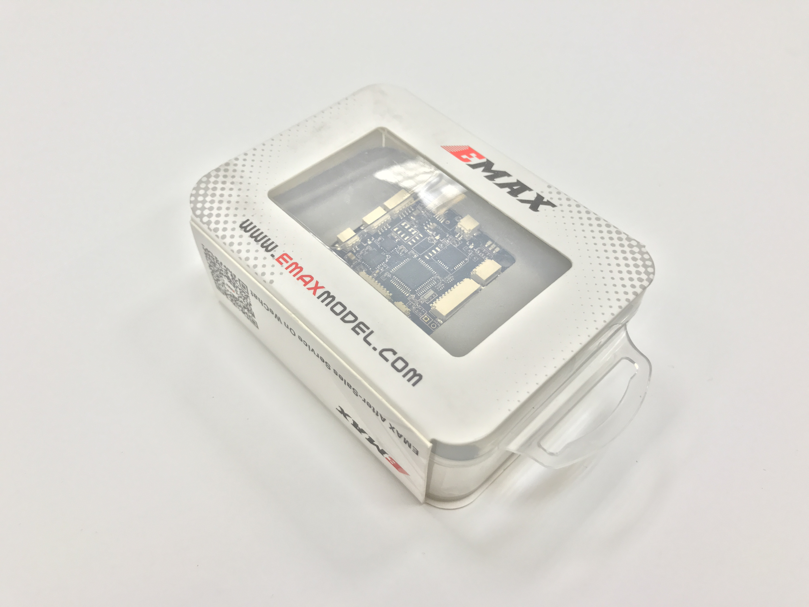

# Part 3 FC Overview {#build-part3-fc-overview status=ready}

## Preface

In this phase of the build, you will configure and calibrate the drone's devices. This includes:

- Configuring the flight controller for our desired mode of operation
- Calibrating the ESCs with respect to the flight controller

The flight controller will receive roll, pitch, yaw, and thrust instructions from the drone's computer and send corresponding electrical signals to the ESCs (i.e. *PWM signals*). The ESCs will use those signals to send variable amounts of power to the motors. Then, the motors will spin in such a way so that the desired roll, pitch, yaw, and thrust are achieved. The flight controller knows what signals to send to the ESCs because it has an **IMU** (i.e. Inertial Measurement Unit), which measures the roll, pitch, and yaw of the drone.

<col2 figure-caption="Build Part 1 Materials" class="labels-row1">
    Part  Quantity
    1 square inch of double sided tape 1
    USB to Micro USB cable 1
    base station 1
</col2>

## Hardware

### Flight Controller

The flight controller (i.e. FC) contains multiple sensors: an Inertial Measurement Unit (IMU) and a gyroscope. The IMU measures linear accelerations and the gyroscope measures angular velocities. The flight controller also receives commands from the Pi and them sends electric signals to the ESCs.

<figure>
     <figcaption>Flight Controller</figcaption>
    
</figure>
