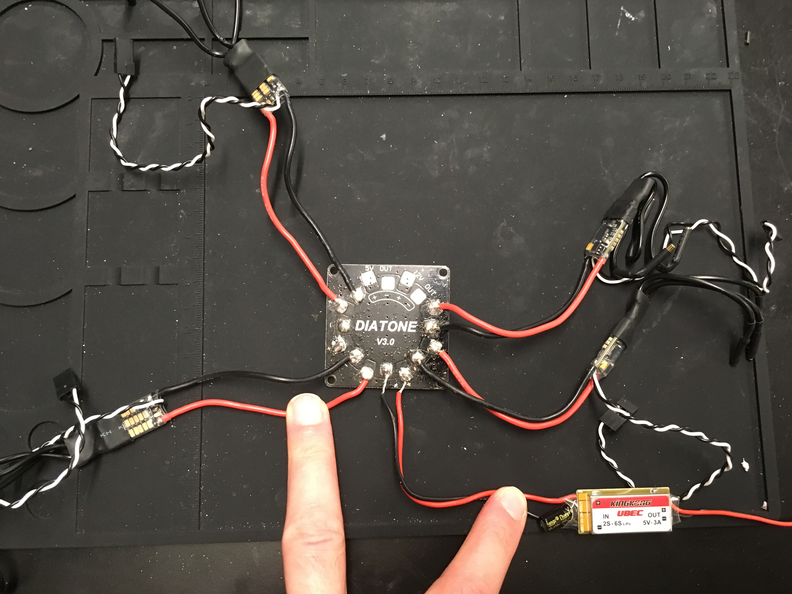
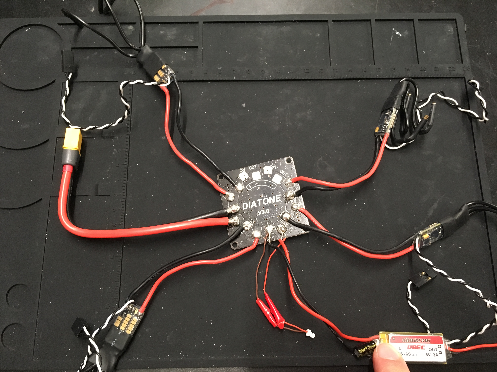
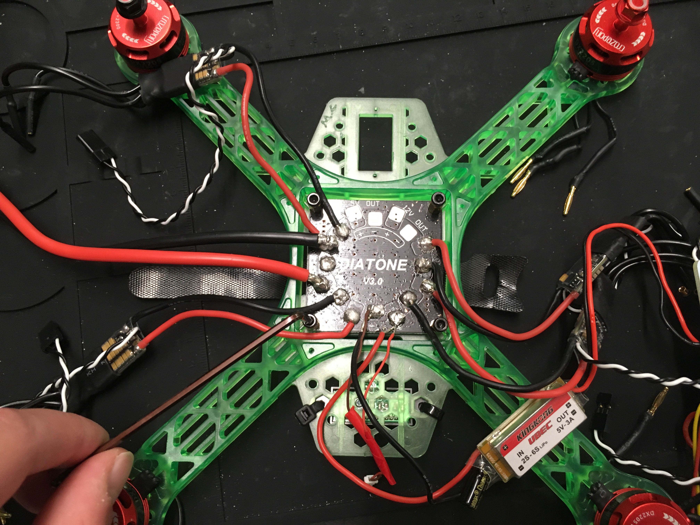

# Phase 1: Establish Power Distribution {#part:build-phase1 status=ready}

**Expected Time**: 2 hours

## Preface

A drone contains many electronic components that enable it to fly. These components require power (via a voltage source) in order to function. 

In this phase of the build, you will establish power distribution to your drone so that all its components receive power. At a high level, establishing power distribution requires the following:

- A component(s) which requires power

- A power connector cable that provides power when a power source (e.g. battery) is connected to it

- A PDB (i.e. Power Distribution Board) that receives power from a power connector cable and provides it to each component that requires power.

Visually, the flow of power looks like:

<figure>
    
</figure>

## Tin the PDB

Similar to exposed wires, the metal pads on a PDB need to be tinned. This will allow tinned wires to be joined to the pads - and therefore the PDB.

**Action Items**: 

- Tin every pad on the PDB, **except** the 5V and 12V pads.    

<figure>
    
</figure>

**Notes**:

- Unless stated otherwise, red wires should be soldered to positive (+) pads and black wires should be soldered to negative (-) pads.    
- Be careful not to aggresively push the soldering iron tip into the PDB, as too much force will cut the pads right off!    

## Solder ESCs to the PDB

An ESC (i.e. Electronic Speed Control) is a component which requires power. It takes this power and provides a variable amount of it to a motor; since a motor's RPM depends on how much power it gets, an ESC can control how fast a motor spins by controlling how much power it supplies the motor.

**Action Items**:

- Solder each of your 4 ESCs to the PDB.   

<figure>
    
</figure>

**Notes**: 

- Do **not** solder the wires flat against the PDB - solder them at ~15&deg; angle. If you solder them flat, then you will not be able to fit the PDB into the drone frame.

## Solder BEC to the PDB

A BEC (i.e. Battery Eliminator Circuit) is a component which requires power. It takes this power and outputs a constant amount of lower power (in technical terms, it performs a *voltage drop*. Our BEC does a 12V to 5V voltage drop). The BEC is important because some components in latter phases require lower power than supplied by the battery.

**Action Items**: 

- Solder your BEC to the PDB.    

<figure>
    
</figure>

**Notes**:

- Like before, solder wires at ~15&deg; angle. 

- Solder the wires on the IN side of the BEC (i.e. the wires you tinned in the Prep Work phase) to the PDB, not the OUT side. "IN" is short for "input", which is why its wires should connect to the PDB.       

## Solder red and brown wire pair to the PDB

The red and brown wire pair (from the flight controller box) is a component which requires power. It takes this power and simply passes it along to the white stub on the other end. What is the point of this? In a latter phase, you will connect the white stub to your flight controller. This will allow the flight controller to *observe* or *monitor* the power traversing the PDB. For this reason, the red and brown wire pair is called the *battery monitor lead*.    

**Action Items**:

- Solder the red and brown wire pair to the PDB. Due to its small size, you will need to solder onto another pair of wires, e.g. BEC wires. The red wire should connect to a positive (+) pad and the brown wire should connect to a negative (-) pad.     

<figure>
    <figcaption>ESCs, BEC, and red/brown connector soldered to PDB</figcaption>
    
</figure>

**Notes**: 

- While trying to solder on these wires, you may accidentally unsolder the existing wires from the PDB. We recommend temporarily holding down the existing wires with long-nose pliers, tape, or helping hands.     

## Solder XT60 Connector Cable to the PDB

A XT60 connector cable is a component which provides power when a power source (e.g. battery) is connected to it. By soldering it to the PDB, the PDB will get power to distribute to other components.    

**Action Items**: 

- Solder your XT60 connector cable to the PDB.  

<figure>
    
</figure>

**Notes**: 

- Since this wire is thicker than the others, it is more difficult to solder to the pads. Be careful not to solder/cut the pads off the PDB!     

## Attach parts to drone frame

This section will cover attaching the first set of items to the drone frame.

Before beginning, verify the PDB is completely soldered with all necessary parts (as covered in previous sections).

For reference, here are the motor directions with respect to the frame:

<figure>
    
</figure>

1. Gather the following:

   - Drone frame
   
   - Completed PDB
   
   - 4 motors (2 CW, 2 CCW)
   
   - Velcro
   
   - 6 standoffs
   
   - 8 black bolts (in motors box)
   
2. Place the drone frame on a flat surface so that the back is facing you.

<figure>
    
</figure>
 
3. Feed the velcro through the center of the drone frame. Make sure the fuzzy side is facing down.
   
<figure>
    
</figure>

4. Screw one black screw into each of the standoffs.

<figure>
    
</figure>

5. Place the completed PDB into the center of the drone frame. For each of the 4 corner screw holes of the PDB, screw a standoff through the hole and into the drone frame. Note that the drone frame doesn't have screw grooves for the standoffs - you will create these grooves by lightly applying downward force while screwing. Once the PDB is secure, remove the black bolts from the standoffs. It may help to use long-nose pliers to hold the standoffs while unscrewing.

<figure>
    
</figure>

6. Attach CW motors to the bottom-right and top-left of the drone frame, using 2 black bolts for each attachment.

<figure>
    
</figure>

7. Attach CCW motors to the bottom-left and top-right of the drone frame, using 2 black bolts for each attachment.

8. For each motor, connect its male bullect connectors to the female bullet connectors of the ESC in the motor's corner (e.g. top-left motor connects to top-left ESC). Any connection order will suffice for now, as you will be able to change them in a latter phase.

<figure>
    
</figure>

## Checkoff

- Visually inspect the drone to verify the following:

  - All red wires connected to the PDB are connected to positive (+) pads
  
  - All black wires connected to the PDB are connected to negative (-) pads
  
  - The wires on the IN side - **NOT** the OUT side - of the BEC are soldered to the PDB
  
  - For the battery monitor lead: the red wire is connected to a positive (+) pad while the brown wire is connected to a negative (-) pad

- Do a [connectivity check]() on the PDB; verify there is:

  - a short between any positive (+) pad and any other positive (+) pad
  
  - a short between any negative (-) pad and any other negative (-) pad
  
  - **no short** between any positive (+) pad and any negative (-) pad

- **ONLY** if the connectivity check passed, do a [DC voltage check]() on the PDB; plug in a 12V battery and verify there is:

  - ~0V between any positive (+) pad and any other positive (+) pad
  
  - ~0V between any negative (-) pad and any other negative (-) pad
  
  - ~12V between any positive (+) pad and any negative (-) pad. 
  
    NOTE: if the battery is X volts instead of 12 volts (e.g. 10), then the multimeter will show X volts instead of 12 volts.

- **ONLY** if the DC voltage check passed, re-connect a battery to your drone and verify the following:

  - The ESCs emitted a quick succession of 3 beeps.
  
  - The bottom of the drone frame is illuminating, due to the LEDs on the bottom of the PDB.
